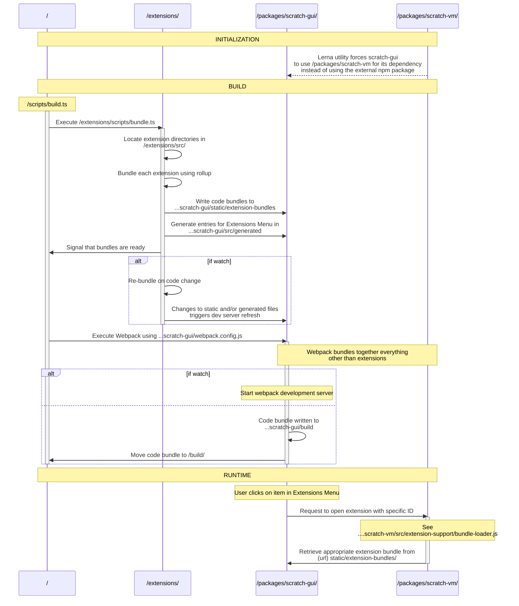

# Extensions

This document aims to complement the information provided in the [root README.md](https://github.com/mitmedialab/prg-extension-boilerplate/blob/main/README.md) (especially the [extensions section](https://github.com/mitmedialab/prg-extension-boilerplate/blob/main/README.md#-how-to-program-an-extension)).

Here we drill down more into the development details associated with extensions. 

This document will be most helpful for people doing more complex development, like:
- Adding UI to extensions
- Writing tests for extensions 
- Porting vanilla Javascript extensions to the use the newer Typescript Extension Framework
- Working on the Typescript Extension Framework itself

[](GeneratedContentGuardStart_NoChangesInThisSectionWillBeSaved)
# Table of Contents
1. [Anatomy of an Extension Directory](#anatomy-of-an-extension-directory)
2. [Testing Extensions](#testing-extensions)
3. [Creating UI for Extensions](#creating-ui-for-extensions)
4. [Porting an Extension to use our Framework & Typescript](#porting-an-extension-to-use-our-framework--typescript)
5. [Reference](#reference)
6. [Saving Custom Data for an Extension](#saving-custom-data-for-an-extension)

## Anatomy of an Extension Directory

> NOTE: This is a generated README section, so no edits you make to it in this file will be saved. 
If you want to edit it, please go to [extension/documentation/src/anatomy/README.md](https:/github.com/mitmedialab/prg-extension-boilerplate/tree/dev/extension/documentation/src/anatomy/README.md)

Extensions are defined by all the files that appear in their associated directory, located within `/extensions/src/`.

This directory is created when you run the command `npm run new:extension <extension name>` from the root of the project, where the value you provide for `<extension name>` is used to name this new directory. 

> **NOTE:** It is important to keep in mind that the name of an extension's associated directory is internally used to identify it, so it is best to avoid changing the directory's name (as this could affect previously saved `.sb3` projects that reference the extension).

### Included Files

Below are the files you should always find within an extension's directory:

- `index.ts`
    - This is the main place where your extension is implemented. It is **expected** that your extension class will be the `default export` of this file. For example:
```ts
export default class ExampleExtension extends Extension<DisplayDetails, Blocks> {
  init;
  defineBlocks;
}
```

- `index.test.ts`
    - This is where you can implement both `unit` and `integration` tests for your extension.
    - Hop down to [Testing Extension](#testing-extensions) for more info.
- `package.json`
    - Each extension is treated as it's own package and thus has it's own [package.json](https://docs.npmjs.com/cli/v9/configuring-npm/package-json) file. 
        - This makes it easy to handle cases when two extensions want to use different versions of the same [npm package](https://www.npmjs.com/). 

### Auxiliary Files

In adition to the above files, you might find any of the below: 

- `.png` or `.jpg` files
    - Image files included in an extension directory are likely either used for icons and/or tutorials.
- `.svelte` files
    - Extensions can have their own associated UI windows, which are implemented using the [Svelte Frontend Framework](https://svelte.dev/).
    - Hop down to [Creating UI for Extensions](#creating-ui-for-extensions) for more info.
- `translations.ts`
    - In the future, this file will be used to support defining an extension's display text in mulitple languages.
    - Currently **NOT** used.
- Additional `.ts` files
    - Developers are free to create as many typescript files as they need within their extensions's directory -- and frankly it's encouraged! Long files can be difficult to read. 
- `README.md`
    - Motivated developers might include a README file to help document their extension. 

### Official Examples

A great to start digging into the files that make up an Extension is to check out some working examples:

- [Simple](https://github.com/mitmedialab/prg-extension-boilerplate/tree/dev/extensions/src/simple_example)
- [Complex](https://github.com/mitmedialab/prg-extension-boilerplate/tree/dev/extensions/src/complex_example)

## Testing Extensions

> NOTE: This is a generated README section, so no edits you make to it in this file will be saved. 
If you want to edit it, please go to [extension/documentation/src/testing/README.md](https:/github.com/mitmedialab/prg-extension-boilerplate/tree/dev/extension/documentation/src/testing/README.md)

Writing tests is an important part of creating maintainable software.

In addition to identifying bugs during an initial implementation or after a refactor, tests can serve to document your code and demonstrate its usage.

### Learning by example

The below examples will test the below extension:

```ts

import { Extension } from "$common/Extension";
import { Environment, ButtonBlock, ArgumentType, BlockType, BlockDefinitions } from "$common";

export default class ExtensionUnderTest extends Extension<DefaultDisplayDetails, {
  exampleReporter: (input: string) => string;
  exampleCommand: (a: number, b: number) => void;
  exampleButtonThatOpensUI: ButtonBlock
}> {

  init(env: Environment): void { }

  defineBlocks(): ExtensionUnderTest["BlockDefinitions"] {
    return defineBlocksElsewhere(); // You can ignore this!
  }
}

```


<details>
<summary>To save space, the block definitions are hidden, but you can open this if you need to see them:</summary>

```ts

const defineBlocksElsewhere = (): BlockDefinitions<ExtensionUnderTest> => ({
  exampleCommand: {
    type: BlockType.Command,
    args: [ArgumentType.Number, ArgumentType.Number],
    text: () => "",
    operation: () => { },
  },
  exampleReporter: {
    type: BlockType.Reporter,
    text: () => "",
    arg: ArgumentType.String,
    // This is the same dummy value used by the tests
    operation: () => "Whatever you expect to be the output, given the input",
  },
  exampleButtonThatOpensUI: (ext) => ({
    type: BlockType.Button,
    text: "",
    operation: () => { ext.openUI("Test") }
  })
});

```


</details>

### Anatomy of a test

Extension test suites will make use of the `createTestSuite` utility function implemented in [extensions/testing/index.ts]() (available under the alias `$testing`).

```ts

import { createTestSuite } from "$testing";
// Import our extension exported as default from the index.ts file ("." is shorthand for "./index")
// NOTE: you can call this import whatever you want, but we use "Extension" to enable the use of "shorthand property names" below (see: https://ui.dev/shorthand-properties)
import Extension from ".";

/**
 * Utilize the `createTestSuite` function.
 * The first argument is an object with the properties:
 * - Extension: a reference to the class you want to test that extends the Extension base class
 * - __dirname: Here, we must tap into the built in '__dirname' variable availabe when running Node based code. See: https://nodejs.org/docs/latest/api/modules.html#__dirname
 * The second argument is an object with the following properties:
 * - unitTests: An object where the keys are the names of your Extension's block functions, and their values are unit-test cases. See more below.
 * - integrationTests: An object where the keys are names of tests you specify and the values are a single integration-test case . See more below.
 */
createTestSuite({ Extension, __dirname }, {
  unitTests: seeBelow,
  integrationTests: seeBelow
});

```

> Included links:
> * https://ui.dev/shorthand-properties
> * https://nodejs.org/docs/latest/api/modules.html#__dirname

As is clear from the second argument of the createTestSuite function, there are two different types of tests:
  - [Unit Tests](#unit-tests)
  - [Integration Tests](#unit-tests)

### Unit Tests

Specifically for extensions, [unit tests](https://en.wikipedia.org/wiki/Unit_testing) test the operation of a single block.

A unit test for a block is defined as an entry in the unitTests object whose key is the name of the block (as defined in the second generic parameter of the Extension class -- for example, this means either `exampleReporter`, `exampleCommand`, or `exampleButtonThatOpensUI`).

The values will either be (1) an object of a certain type, (2) a function that returns an object of that certain type, or (3) an array of either. The object type can have the keys outlined below:

#### Simple Example

```ts

createTestSuite({ Extension, __dirname }, {
  unitTests: {
    /** A test case of the 'exampleReporter' block defined as an object with 'input' and 'expected' entries */
    exampleReporter: {

      /** 
       * For blocks that take arguments, an 'input' field must be provided which will be passed to the block's "operation" as an argument.
       * Because the 'exampleReporter' block only takes one arg, this is a single value. If there were multiple, this field would take an array. 
       */
      input: "Some input",

      /** 
       * For blocks that return a value (most commonly 'reporter' blocks), an 'expected' field must be provided.
       * This will automatically be compared against the value returned by the block's "operation" and if they don't match the test will fail.
       */
      expected: "Whatever you expect to be the output, given the input"
    },
  }
});

```


#### Complex Example

```ts

createTestSuite({ Extension, __dirname }, {
  unitTests: {
    /** Below we provide multiple test cases for the 'exampleReporter' block, and thus we define this as an array. */
    exampleReporter: [
      /** The same test case as before, again expressed as an object */
      {
        input: "Some input",
        expected: "Whatever you expect to be the output, given the input"
      },

      /** 
       * Below is a test expressed as a function that returns an object with 'input', 'expected', 'isReady', 'checkIsReadyRate', 'before', and 'after' entries. 
       * This function has single argument which is a TestHelper object, which should assist you in writing your test cases.
       * This test case represents all the fields a given test can define, and these can similiarly be defined for a test expressed as an object.
      */
      (testHelper) => {
        const expected = "Whatever you expect to be the output, given the input";
        let i = 0;
        return {
          /** See above */
          input: "Some input",
          /** See above */
          expected,

          /** 
           * An 'isReady' function can be defined which must return true for the test to begin. 
           * This function will be given the instance of the extension under test. 
           */
          isReady: (extension) => {
            // Obviously this is a silly piece of logic. 
            // It'd be more realistic to, say, check that a model is loaded, or that an API call has returned, etc.
            return ++i > 4;
          },

          /** This field allows you to define the rate at which 'isReady' will be called. But likely, you can just leave this one out! */
          checkIsReadyRate: 300,

          /**
           * A 'before' function can be defined which will run right before the block "operation" is executed.
           * This can be used to:
           * - modify the extension before the block is executed to create a specific situation
           * - pair it with an 'after' function to confirm a value does (or doesn't) change when the block is executed.
           */
          before: (fixture) => {
            const { extension, testHelper } = fixture;
            testHelper.expect(1).not.toBe(2);
          },

          /** 
           * An 'after' function can be defined which will run right after the block "operation" is executed.
           * This will likely be used in many of your tests, especially for non-reporter blocks, as this is where you can make your test's assertions.
           * Should the value of one of the extension's fields changed when a command block was ran? 
           * How should the UI behave that a button-block opens? 
           * These kinds of things are what you can check for in the 'after' function.
          */
          after: (fixture) => {
            const { extension, testHelper, ui, result } = fixture;

            // This is a redunant check, since the test framework automatically checks that the result matches the expected value.
            // But this demonstrates how an `after` test function can be used to further probe the output of a reporter block.
            testHelper.expect(result).toBe(expected);

            // Since our block does not open any UI, the value of 'ui' pulled from the fixture won't be defined.
            // This again is not a valuable thing to check as far as the test goes and is just for demonstration.
            testHelper.expect(ui).toBeUndefined();
          }
        }
      }
    ],
  },
});

```


#### Testing UI

It is also possible to test the creation of UI (say if your block executes the `openUI` Extension function).

See the below example:

```ts

createTestSuite({ Extension, __dirname }, {
  unitTests: {
    exampleButtonThatOpensUI: {
      after: async (fixture) => {
        const { ui, testHelper: { expect, fireEvent } } = fixture;

        // This will find all HTML elements marked with a `data-testid` attribute matching "mySpecialButton".
        // For example, the below would find the following element if it belong to the UI opened up by my block:
        // <button data-testid="mySpecialButton" />
        const matches = await ui.findAllByTestId("mySpecialButton");

        expect(matches.length).toBe(1);

        const button = matches[0];
        await fireEvent.click(button);

        // Now you could 'expect' that something happened! 
      }
    }
  }
});

```


<details>
<summary>Open this if you'd like to see the UI (Svelte) component beind tested (it's not very exciting)</summary>

```ts
<script lang="ts">
  import type Extension from ".";

  // svelte-ignore unused-export-let
  export let extension: any;
  // svelte-ignore unused-export-let
  export let close: () => void;
</script>

<button data-testid="mySpecialButton"></button>
```


</details>

The `ui` object you can interact with within this test is based on the [Testing Library](https://testing-library.com/);

See [their documentation](https://testing-library.com/docs/) for a complete guide on how to [query for elements](https://testing-library.com/docs/queries/about) and [interact with them](https://testing-library.com/docs/dom-testing-library/api-events).

### Integration Test

Specifically for extensions, [integration tests]() test either the operations of multiple blocks or how one extension interacts with another.

They are implemented as functions as you can see below:

```ts

createTestSuite({ Extension, __dirname }, {
  unitTests: seeAbove,
  integrationTests: {
    /**
     * An integration test case 
     * @param fixture The fixture that will be passed to this function contain all the necessary elements for writing your test. 
     * We use the term 'fixture' here and elsewhere as a "A test fixture is an environment used to consistently test a piece of software."
     * https://en.wikipedia.org/wiki/Test_fixture
     */
    testOfTwoBlocks: async (fixture) => {
      const { blockRunner, testHelper: { expect }, extension } = fixture;

      // Execute the block via the blockRunner (@see $testing/BlockRunner.ts)
      const result = await blockRunner.invoke("exampleReporter", "test input");
      const { output, ui } = result;

      expect(output).toBeDefined();

      // The "exampleReporter" block doesn't open ui, so here we demonstrate this value won't be defined.
      // If your test DOES open UI, the 'ui' object is the same as in the unit test for the "exampleButtonThatOpensUI" block
      expect(ui).toBeUndefined();

      await blockRunner.invoke("exampleCommand", output.length, 10);

      // Below you could assert something that "exampleCommand" block did the appropriate thing given the inputs
    },
    testOfTwoExtensions: async (fixture) => {
      const { blockRunner, testHelper: { expect }, extension } = fixture;

      // Here we create a "companion extension". To not confuse things with another Extension definition, we use the same 'ExtensionUnderTest' class as in our other tests.
      // However, the `createCompanion` function should mainly be used to create a companion BlockRunner for a DIFFERENT extension.
      // This way, you can test how two extensions interact with each other.
      const companionExtension = blockRunner.createCompanion(Extension);

      // We can check that even though the extensions are the same type, 
      // the 'blockRunner.createCompanion' function actually creates a brand new instance.
      expect(extension).not.toBe(companionExtension.instance);

      // Below you could invoke blocks on either extension instance and confirm they don't cause errors with each other.
    }
  }
})

```

> Included links:
> * https://en.wikipedia.org/wiki/Test_fixture

## Creating UI for Extensions

> NOTE: This is a generated README section, so no edits you make to it in this file will be saved. 
If you want to edit it, please go to [extension/documentation/src/ui/README.md](https:/github.com/mitmedialab/prg-extension-boilerplate/tree/dev/extension/documentation/src/ui/README.md)

To develop UI for your extension, we ask that you implement an interface that will be rendered in a [modal](https://blog.hubspot.com/website/modal-web-design#:~:text=What%20is%20a%20modal?) / pop-up.

Extension UI is implemented using the [Svelte Frontend Framework](https://svelte.dev/).

Please first make sure you've satisfied [Svelte Dependency](https://github.com/mitmedialab/prg-extension-boilerplate#svelte-only-if-you-are-developing-ui).

To generate a new svelte file, run the following command:

```bash
npm run add:ui <extension folder>
# For example: npm run add:ui myExtension
```

If succesful, the above command will point you to a generated file with the `.svelte` file-extension that lives inside of your extension's directory.

Feel free to change the name of this file to match it's intended usage, e.g. `Editor.svelte` or `AddItem.svelte` 

> **NOTE:** The convention is to use [Pascal Case](https://www.theserverside.com/definition/Pascal-case) to name svelte files, so they often start with a capital letter (unlike `.js` or `.ts` files).

### Open UI Using a Button

The most common (and recommended) way to open UI via your extension is to (1) implement a `ButtonBlock` and (2) invoke the Extension function `openUI` within the block's `operation` (which will be called when the button is clicked).

To do so, first declare a `ButtonBlock`, e.g.:

```ts

import { Extension, ButtonBlock, BlockDefinitions } from "$common";

type Blocks = {
  someButton: ButtonBlock;
}

class ExampleExtension extends Extension<DefaultDisplayDetails, Blocks> {
  init = notImportant
  defineBlocks = seeBelow;
}

```


Next, implement the `ButtonBlock` definition inside of the object returned by the `defineBlocks` function. As usual, the defintion of the `ButtonBlock` is a function that returns an object containing all of the details needed to define the block. 

Most importantly, within the `operation` function of the block's definition, the function `openUI` should be invoked (which is implemented on the base `Extension` class, and can therefore be invoked using the reference to the Extension passed as the only argument to the block definition function, i.e. `self` below).

For example:

```ts

export default class ExampleExtension extends Extension<DefaultDisplayDetails, Blocks> {
  init = notRelevantToExample;

  defineBlocks(): ExampleExtension["BlockDefinitions"] {
    return {
      someButton: () => ({
        type: BlockType.Button,
        text: `Button Text Goes Here`,
        operation: () => this.openUI("SvelteFileName", "Title of Window")
      })
    }
  }
}

```


The first argument is the name of the `.svelte` file in which your UI is implemented -- this name must match your filename exactly (but you can omit the `.svelte` extension).

The second argument is the title that will display at the top of the modal window. If omitted, this will default to the name of your extension.


## Porting an Extension to use our Framework & Typescript

> NOTE: This is a generated README section, so no edits you make to it in this file will be saved. 
If you want to edit it, please go to [extension/documentation/src/porting/README.md](https:/github.com/mitmedialab/prg-extension-boilerplate/tree/dev/extension/documentation/src/porting/README.md)

*Want to move your vanilla-JS extension to our Typescript framework and reap the benefits of type safety and code generation?* **Great!**

Here's how:

1. Identify the following details of the "old" extension / the extension you want to port (if you're having trouble finding any, skip around to see if finding one detail helps you identify where to specifically to look for another):
    - ***Implementation***: Where the extension is actually implemented in [vanilla js](https://www.javatpoint.com/what-is-vanilla-javascript)
        - This should be in some folder inside of [packages/scratch-vm/src/extensions/](https://github.com/mitmedialab/prg-extension-boilerplate/tree/main/packages/scratch-vm/src/extensions)
        - Each extension implemenation folder will have at least an `index.js` file as this is responsible for exporting a [class](https://developer.mozilla.org/en-US/docs/Web/JavaScript/Reference/Classes) definition (and this class can actually be thought of as the extension)
    - ***Extension ID***: The unique identifier of the extension used by the [Scratch Virtual Machine](https://github.com/LLK/scratch-vm/) to "look up" the extension:
        - You can find this inside of the [packages/scratch-vm/src/extension-support/extension-manager.js](https://github.com/mitmedialab/prg-extension-boilerplate/blob/main/packages/scratch-vm/src/extension-support/extension-manager.js) file within the declaration of the `builtinExtensions` object (somewhere near the top of the file)
        - The `builtinExtensions` object has keys corresponding to ***Extension ID***s and their value is a function that `requires` (or loads in) the corresponding ***Implementation***
    - ***Extension Menu Entry***: The details that define how an extension displays inside of the [Extension Menu](https://en.scratch-wiki.info/wiki/Extension#Adding_Extensions) (see "Adding Extensions") and effectively connects the the [GUI](https://github.com/LLK/scratch-gui) that the user sees with the [Virtual Machine](https://github.com/LLK/scratch-vm/) that controls executing extension blocks
        - You will find this in one of the objects within the array exported by [packages/scratch-gui/src/lib/libraries/extensions/index.jsx](https://github.com/mitmedialab/prg-extension-boilerplate/blob/main/packages/scratch-gui/src/lib/libraries/extensions/index.jsx)
        - To locate the object that corresponds to the extension you want to port, you can use the ***Extension ID*** (if you have it) which corresponds to the `extensionId` field, or you can use the name or description of the extension you see in the Extensions Menu of the [live site](https://playground.raise.mit.edu/main/) which (you guessed it) correspond to the `name` and `description` fields, respectively
2. Create your "new" framework-based extension using the command outlined in [Making an Extension](https://github.com/mitmedialab/prg-extension-boilerplate/tree/main#-making-an-extension) and use the ***Extension ID*** you found in step 1 as the value of `<folder to contain extension>`
    - For example, if your "old" extension's ***Extension ID*** is `prgRocks` you'll run the following command:
    ```bash
    npm run new:extension prgRocks
    ``` 
    - The reason this is necessary is two-fold: First, in the new extension framework, the name of the folder that contains an extension is automatically used as its ***Extension ID***. Second, because already saved `.sb3` / Scratch projects that use your extension refernce the specific ***Extension ID***, we need to make sure our updated, typescript-based extension has the same ID.
3. Once you have created an extension with a folder name matching the ***Extension ID*** found in step 1, you can actually delete the corresponding entry inside of the `builtinExtensions` object of [packages/scratch-vm/src/extension-support/extension-manager.js](https://github.com/mitmedialab/prg-extension-boilerplate/blob/main/packages/scratch-vm/src/extension-support/extension-manager.js)
    - This means that now when someone clicks on your extension from the [Extension Menu](https://en.scratch-wiki.info/wiki/Extension#Adding_Extensions), it will load your new extension and not the old one.
4. Use the details of the ***Extension Menu Entry*** to fill out the the details of the first generic parameter of the `Extension<..., ...>` class inside of the `index.ts` file that was created by the command in Step 2.
    - If that seems confusing, just go look inside of the `index.ts` and hopefully the documentation should make this more clear
    - Copy over text and boolean values (excluding the `extensionId` field)
    - For things like icons (which are likely imported), copy/move those files into your new extension folder and delete them from their old location
5. Once you migrate all ***Extension Menu Entry*** details to your new extension, you can remove the ***Extension Menu Entry*** object from the array exported by [packages/scratch-gui/src/lib/libraries/extensions/index.jsx](https://github.com/mitmedialab/prg-extension-boilerplate/blob/main/packages/scratch-gui/src/lib/libraries/extensions/index.jsx)
    - You can do this as the extension framework will automatically handle adding your extension (and its Extension Menu Display Details) to the [Extension Menu](https://en.scratch-wiki.info/wiki/Extension#Adding_Extensions)
6. Now you can start coding! See the below comparison of a vanilla JS extension class and a typescript / framework based one.
7. Once you have migrated all of the "old" ***Impementation*** to your new extension folder & typescript code, you can go ahead and delete the ***Implementation*** folder inside of [pacakges/scratch-vm/src/extensions/](https://github.com/mitmedialab/prg-extension-boilerplate/tree/main/packages/scratch-vm/src/extensions).
8. Now, there should be no remnants of the "old" extension inside of either [packages/scratch-vm](https://github.com/mitmedialab/prg-extension-boilerplate/tree/main/packages/scratch-vm) or [packages/scratch-gui](https://github.com/mitmedialab/prg-extension-boilerplate/tree/main/packages/scratch-gui) folders, and instead everything lives neatly inside its own directory within [extensions/src](https://github.com/mitmedialab/prg-extension-boilerplate/tree/dev/extensions/src)


### Vanilla JS

Below is a sample, vanilla JS extension based on the final example provided in the [Scratch Extensions document](https://github.com/LLK/scratch-vm/blob/develop/docs/extensions.md). 

What's not captured in the below example is all the additional work necessary to get the extension to show up (hinted at above), which includes:
- Updating [extension library jsx](https://github.com/mitmedialab/prg-extension-boilerplate/blob/main/packages/scratch-gui/src/lib/libraries/extensions/index.jsx#L71)
- Updating [extension manager](https://github.com/mitmedialab/prg-extension-boilerplate/blob/main/packages/scratch-vm/src/extension-support/extension-manager.js#L11) to support this extension 

Every step of this process is not typesafe, and thus very error prone.

```js
const ArgumentType = require('../../extension-support/argument-type');
const BlockType = require('../../extension-support/block-type');
const TargetType = require('../../extension-support/target-type');
const formatMessage = require('format-message');

class SomeBlocks {
    constructor (runtime) {
        this.runtime = runtime;
    }

    /**
     * @return {object} This extension's metadata.
     */
    getInfo () {
        return {
            id: 'someBlocks',

            // Core extensions only: override the default extension block colors.
            color1: '#FF8C1A',
            color2: '#DB6E00',
            
            name: formatMessage({
                id: 'extensionName',
                defaultMessage: 'Some Blocks',
                description: 'The name of the "Some Blocks" extension'
            }),

            blockIconURI: 'data:image/png;base64,iVBORw0KGgoAAAANSUhEUgAAAAkAAAAFCAAAAACyOJm3AAAAFklEQVQYV2P4DwMMEMgAI/+DEUIMBgAEWB7i7uidhAAAAABJRU5ErkJggg==',
            menuIconURI: 'data:image/png;base64,iVBORw0KGgoAAAANSUhEUgAAAAkAAAAFCAAAAACyOJm3AAAAFklEQVQYV2P4DwMMEMgAI/+DEUIMBgAEWB7i7uidhAAAAABJRU5ErkJggg==',

            blocks: [
                {
                    opcode: 'myReporter', 
                    blockType: BlockType.REPORTER,
                    branchCount: 0,
                    terminal: true,
                    blockAllThreads: false,
                    text: formatMessage({
                        id: 'myReporter',
                        defaultMessage: 'letter [LETTER_NUM] of [TEXT]',
                        description: 'Label on the "myReporter" block'
                    }),
                    arguments: {
                        LETTER_NUM: {
                            type: ArgumentType.NUMBER,
                            default: 1
                        },
                        TEXT: {
                            type: ArgumentType.STRING,
                            default: formatMessage({
                                id: 'myReporter.TEXT_default',
                                defaultMessage: 'text',
                                description: 'Default for "TEXT" argument of "someBlocks.myReporter"'
                            }),
                            menu: 'menuA'
                        }
                    },

                    func: 'myReporter',
                    filter: [TargetType.SPRITE]
                }
            ],
            menus: {
                menuA: [
                    {
                        value: 'itemId1',
                        text: formatMessage({
                            id: 'menuA_item1',
                            defaultMessage: 'Item One',
                            description: 'Label for item 1 of menu A in "Some Blocks" extension'
                        })
                    },
                    'itemId2'
                ]
            },
        };
    };
    
    myReporter (args) {
        const message = formatMessage({
            id: 'myReporter.result',
            defaultMessage: 'Letter {LETTER_NUM} of {TEXT} is {LETTER}.',
            description: 'The text template for the "myReporter" block result'
        });

        const result = args.TEXT.charAt(args.LETTER_NUM);

        return message.format({
            LETTER_NUM: args.LETTER_NUM,
            TEXT: args.TEXT,
            LETTER: result
        });
    };
}
```

### Typescript Extension Framework

Things to note:
- The `Details` type object encodes how the extension will be displayed in the extensions menu
    - No more editing [any jsx](https://github.com/mitmedialab/prg-extension-boilerplate/blob/main/packages/scratch-gui/src/lib/libraries/extensions/index.jsx#L71) to specify how your extension should display in the Extensions Menu
    - Now your image assets related to your extension should reside in the same place as your implementation (i.e. in the same directory as the `index.ts` file)
- Any index.ts file within a subfolder of the [extensions directory](https://github.com/mitmedialab/prg-extension-boilerplate/tree/main/packages/scratch-vm/src/extensions) will be assumed to implement an extension
    - This means there's no need to specify your extension in the [extension-manager](https://github.com/mitmedialab/prg-extension-boilerplate/blob/main/packages/scratch-vm/src/extension-support/extension-manager.js#L11)
- All Block text is automatically formatted for translation
    - How to actually specify these translations is coming soon! 
    - Translations for extensions are not actually supported via Scratch out of the box, so enabling this for all extensions is a win for the Typescript Framework!
- Fields not yet supported (but will be for official release):
    - [filter](https://github.com/mitmedialab/prg-extension-boilerplate/issues/163)
    - [branchCount](https://github.com/mitmedialab/prg-extension-boilerplate/issues/168)

```ts
import { Extension, ArgumentType, BlockType, Environment } from "$common";
import formatMessage from './format-message'; // This should actually be an npm package and thus be 'format-message'

type Details = {
  name: "Some Blocks",
  description: "A demonstration of some blocks",
  iconURL: "example.png",
  insetIconURL: "inset.png"
};

export default class SomeBlocks extends Extension<Details, {
  myReporter: (text: string, letterNum: number) => string;
}> {

  init(env: Environment) { }

  defineBlocks(): SomeBlocks["BlockDefinitions"] {
    return {
      myReporter: (self: SomeBlocks) => ({
        type: BlockType.Reporter,
        args: [
          {
            type: ArgumentType.String,
            defaultValue: 'text',
            options: [
              { text: 'Item One', value: 'itemId1' },
              'itemId2'
            ]
          },
          { type: ArgumentType.Number, defaultValue: 1 }
        ],
        text: (text, letterNum) => `letter ${letterNum} of ${text}'`,
        operation: (text, letterNum, util) => {

          const message = formatMessage({
            id: 'myReporter.result',
            default: 'Letter {letterNum} of {text} is {result}.',
            description: 'The text template for the "myReporter" block result'
          });

          const result = text.charAt(letterNum);

          return message.format({ text, letterNum, result });
        }
      })
    }
  }
}
```


## Reference

> NOTE: This is a generated README section, so no edits you make to it in this file will be saved. 
If you want to edit it, please go to [extension/documentation/src/reference/README.md](https:/github.com/mitmedialab/prg-extension-boilerplate/tree/dev/extension/documentation/src/reference/README.md)

### How Everything Fits Together


## Saving Custom Data for an Extension

> NOTE: This is a generated README section, so no edits you make to it in this file will be saved. 
If you want to edit it, please go to [extension/documentation/src/saveLoad/README.md](https:/github.com/mitmedialab/prg-extension-boilerplate/tree/dev/extension/documentation/src/saveLoad/README.md)

The Extension Framework allows you to easily save arbitrary data for an extension when an `.sb3` (Scratch 3 format) project is saved. 

You can also set up how your extension utilizes that data when a project is loaded that contains custom save data. 

All you must do is define the `saveDataHandler` property on your extension, like so:

```ts

export default class SaveLoadExample extends Extension<DefaultDisplayDetails, NoBlocks> {

  /** This is an example of some data on an Extension that the user might manipulate over the course of their session and must be preserved in order to restore the same state to the extension */
  somePersistentData = { x: 3, input: "Hello" };

  /**
   * The SaveDataHandler constructor takes an object with 3 values:
   * - Extension: This should be a reference to the Extension class you are implementing. This will then be used as the type for the first 'self' parameter of both `onSave` and `onLoad`.
   * - onSave: A function called when a user SAVES their project which should return some data (likely an object), which will be written to the saved file.
   * - onLoad: A function called when a user LOADS a project. The second parameter 'data' will take on the type of the thing that `onSave` returns. This way, the two functions stay in sync.
   */
  saveDataHandler = new SaveDataHandler({
    Extension: SaveLoadExample,
    // Return the information that we want to save
    onSave(self) { return self.somePersistentData },
    // Use the loaded 'data' to restore the state of our Extension
    onLoad(self, data) { self.somePersistentData = data },
  });


  init = notRelevantToExample;
  defineBlocks = notRelevantToExample;
}

```

[](GeneratedContentGuardEnd_NoChangesInThisSectionWillBeSaved)
