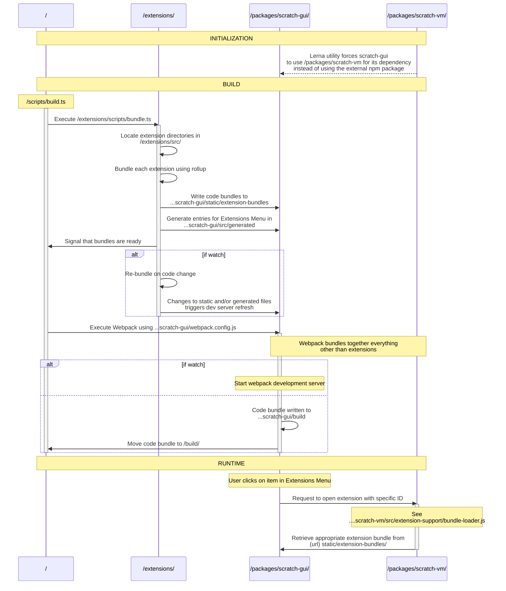

# Extensions

This document aims to complement the information provided in the [root README.md](https://github.com/mitmedialab/prg-extension-boilerplate/blob/main/README.md) (especially the [extensions section](https://github.com/mitmedialab/prg-extension-boilerplate/blob/main/README.md#-how-to-program-an-extension)).

Here we drill down more into the development details associated with extensions. 

This document will be most helpful for people doing more complex development, like:
- Adding UI to extensions
- Writing tests for extensions 
- Porting vanilla Javascript extensions to the use the newer Typescript Extension Framework
- Working on the Typescript Extension Framework itself

[](GeneratedContentGuardStart_NoChangesInThisSectionWillBeSaved)
# Table of Contents
1. [Anatomy of an Extension Directory](#anatomy-of-an-extension-directory)
2. [Testing Extensions](#testing-extensions)
3. [Programming Tutorial](#programming-tutorial)
4. [Creating UI for Extensions](#creating-ui-for-extensions)
5. [Porting an Extension to use our Framework & Typescript](#porting-an-extension-to-use-our-framework--typescript)
6. [Saving Custom Data for an Extension](#saving-custom-data-for-an-extension)
7. [App Inventor Cross-Compilation / Interoperability](#app-inventor-crosscompilation--interoperability)
8. [Making use of the Block Utility & Block ID](#making-use-of-the-block-utility--block-id)
9. [Adding Custom Arguments](#adding-custom-arguments)
10. [Extension Menu Tags / Categories](#extension-menu-tags--categories)
11. [Adding inline images to the text of blocks](#adding-inline-images-to-the-text-of-blocks)
12. [Reference](#reference)

## Anatomy of an Extension Directory

> NOTE: This is a generated README section, so no edits you make to it in this file will be saved. 
If you want to edit it, please go to [extensions/documentation/src/anatomy/README.md](documentation/src/anatomy/README.md)

Extensions are defined by all the files that appear in their associated directory, located within `/extensions/src/`.

This directory is created when you run the command `npm run new:extension <extension name>` from the root of the project, where the value you provide for `<extension name>` is used to name this new directory. 

> **NOTE:** It is important to keep in mind that the name of an extension's associated directory is internally used to identify it, so it is best to avoid changing the directory's name (as this could affect previously saved `.sb3` projects that reference the extension).

### Included Files

Below are the files you should always find within an extension's directory:

- `index.ts`
    - This is the main place where your extension is implemented. It is **expected** that your extension class will be the `default export` of this file. For example:
```ts
export default class ExampleExtension extends extension({ name: "Example" }) {
  init() { /* ... */ };
}
```

- `index.test.ts`
    - This is where you can implement both `unit` and `integration` tests for your extension.
    - Hop down to [Testing Extension](#testing-extensions) for more info.
- `package.json`
    - Each extension is treated as it's own package and thus has it's own [package.json](https://docs.npmjs.com/cli/v9/configuring-npm/package-json) file. 
        - This makes it easy to handle cases when two extensions want to use different versions of the same [npm package](https://www.npmjs.com/). 
        - An extension's `package.json` file also includes [npm scripts](https://docs.npmjs.com/cli/v9/using-npm/scripts) that execute scripts from the [root package.json]() with the exension's folder as an argument. This makes executing certain commands a little easier.
            - For example, if your extension folder is `myExtension`, you can do the following:
                ```
                cd extensions/myExtension # only do this once
                npm run dev 
                ```
             - Instead of running the following from the root of the project every time:
                ```
                npm run dev only=myExtension
                ```
            - Inspect the `package.json` file to see all augmented scripts.

### Auxiliary Files

In adition to the above files, you might find any of the below: 

- `.png` or `.jpg` files
    - Image files included in an extension directory are likely either used for icons and/or tutorials.
- `.svelte` files
    - Extensions can have their own associated UI windows, which are implemented using the [Svelte Frontend Framework](https://svelte.dev/).
    - Hop down to [Creating UI for Extensions](#creating-ui-for-extensions) for more info.
- `translations.ts`
    - In the future, this file will be used to support defining an extension's display text in mulitple languages.
    - Currently **NOT** used.
- Additional `.ts` files
    - Developers are free to create as many typescript files as they need within their extensions's directory -- and frankly it's encouraged! Long files can be difficult to read. 
- `README.md`
    - Motivated developers might include a README file to help document their extension. 

### Official Examples

A great to start digging into the files that make up an Extension is to check out some working examples:

- [Simple](https://github.com/mitmedialab/prg-extension-boilerplate/tree/dev/extensions/src/simple_example)
- [Complex](https://github.com/mitmedialab/prg-extension-boilerplate/tree/dev/extensions/src/complex_example)

## Testing Extensions

> NOTE: This is a generated README section, so no edits you make to it in this file will be saved. 
If you want to edit it, please go to [extensions/documentation/src/testing/README.md](documentation/src/testing/README.md)

Writing tests is an important part of creating maintainable software.

In addition to identifying bugs during an initial implementation or after a refactor, tests can serve to document your code and demonstrate its usage.

### Learning by example

The below examples will test the below extension:

```ts

import { block, buttonBlock, extension, Environment } from "$common";

const name = "Extension Under Test";

export default class ExtensionUnderTest extends extension({ name }, "ui") {

  init(env: Environment): void { }

  @block({
    type: "command",
    args: ["number", "number"],
    text: (x, y) => "placeholder",
  })
  exampleCommand(a: number, b: number) { /* Do something */ }

  @block({
    type: "reporter",
    text: (x) => "placeholder",
    arg: "string",
  })
  exampleReporter(input: string) {
    return "Whatever you expect to be the output, given the input"
  }

  @buttonBlock("placeholder")
  exampleButtonThatOpensUI() {
    this.openUI("Test");
  }
}

```


### Anatomy of a test

Extension test suites will make use of the `createTestSuite` utility function implemented in [extensions/testing/index.ts]() (available under the alias `$testing`).

```ts

import { createTestSuite } from "$testing";
// Import our extension exported as default from the index.ts file ("." is shorthand for "./index")
// NOTE: you can call this import whatever you want, but we use "Extension" to enable the use of "shorthand property names" below (see: https://ui.dev/shorthand-properties)
import Extension from ".";

/**
 * Utilize the `createTestSuite` function.
 * The first argument is an object with the properties:
 * - Extension: a reference to the class you want to test that extends the Extension base class
 * - __dirname: Here, we must tap into the built in '__dirname' variable availabe when running Node based code. See: https://nodejs.org/docs/latest/api/modules.html#__dirname
 * The second argument is an object with the following properties:
 * - unitTests: An object where the keys are the names of your Extension's block functions, and their values are unit-test cases. See more below.
 * - integrationTests: An object where the keys are names of tests you specify and the values are a single integration-test case . See more below.
 */
createTestSuite({ Extension, __dirname }, {
  unitTests: seeBelow,
  integrationTests: seeBelow
});

```

> Included links:
> * https://ui.dev/shorthand-properties
> * https://nodejs.org/docs/latest/api/modules.html#__dirname

As is clear from the second argument of the createTestSuite function, there are two different types of tests:
  - [Unit Tests](#unit-tests)
  - [Integration Tests](#unit-tests)

### Unit Tests

Specifically for extensions, [unit tests](https://en.wikipedia.org/wiki/Unit_testing) test the operation of a single block.

A unit test for a block is defined as an entry in the unitTests object whose key is the name of the block method of the Extension class (for the above example, this means either `exampleReporter`, `exampleCommand`, or `exampleButtonThatOpensUI`).

The values will either be (1) an _object of a certain type_, (2) a function that returns an object of that certain type, or (3) an array of either. The _object of a certain type_ can have the keys outlined below:

#### Simple Example

```ts

createTestSuite({ Extension, __dirname }, {
  unitTests: {
    /** A test case of the 'exampleReporter' block defined as an object with 'input' and 'expected' entries */
    exampleReporter: {

      /** 
       * For blocks that take arguments, an 'input' field must be provided which will be passed to the block's "operation" as an argument.
       * Because the 'exampleReporter' block only takes one arg, this is a single value. If there were multiple, this field would take an array. 
       */
      input: "Some input",

      /** 
       * For blocks that return a value (most commonly 'reporter' blocks), an 'expected' field must be provided.
       * This will automatically be compared against the value returned by the block's "operation" and if they don't match the test will fail.
       */
      expected: "Whatever you expect to be the output, given the input"
    },
  }
});

```


#### Complex Example

```ts

createTestSuite({ Extension, __dirname }, {
  unitTests: {
    /** Below we provide multiple test cases for the 'exampleReporter' block, and thus we define this as an array. */
    exampleReporter: [
      /** The same test case as before, again expressed as an object */
      {
        input: "Some input",
        expected: "Whatever you expect to be the output, given the input"
      },

      /** 
       * Below is a test expressed as a function that returns an object with 'input', 'expected', 'isReady', 'checkIsReadyRate', 'before', and 'after' entries. 
       * This function has single argument which is a TestHelper object, which should assist you in writing your test cases.
       * This test case represents all the fields a given test can define, and these can similiarly be defined for a test expressed as an object.
      */
      (testHelper) => {
        const expected = "Whatever you expect to be the output, given the input";
        let i = 0;
        return {
          /** See above */
          input: "Some input",
          /** See above */
          expected,

          /** 
           * An 'isReady' function can be defined which must return true for the test to begin. 
           * This function will be given the instance of the extension under test. 
           */
          isReady: (extension) => {
            // Obviously this is a silly piece of logic. 
            // It'd be more realistic to, say, check that a model is loaded, or that an API call has returned, etc.
            return ++i > 4;
          },

          /** This field allows you to define the rate at which 'isReady' will be called. But likely, you can just leave this one out! */
          checkIsReadyRate: 300,

          /**
           * A 'before' function can be defined which will run right before the block "operation" is executed.
           * This can be used to:
           * - modify the extension before the block is executed to create a specific situation
           * - pair it with an 'after' function to confirm a value does (or doesn't) change when the block is executed.
           */
          before: (fixture) => {
            const { extension, testHelper } = fixture;
            testHelper.expect(1).not.toBe(2);
          },

          /** 
           * An 'after' function can be defined which will run right after the block "operation" is executed.
           * This will likely be used in many of your tests, especially for non-reporter blocks, as this is where you can make your test's assertions.
           * Should the value of one of the extension's fields changed when a command block was ran? 
           * How should the UI behave that a button-block opens? 
           * These kinds of things are what you can check for in the 'after' function.
          */
          after: (fixture) => {
            const { extension, testHelper, ui, result } = fixture;

            // This is a redunant check, since the test framework automatically checks that the result matches the expected value.
            // But this demonstrates how an `after` test function can be used to further probe the output of a reporter block.
            testHelper.expect(result).toBe(expected);

            // Since our block does not open any UI, the value of 'ui' pulled from the fixture won't be defined.
            // This again is not a valuable thing to check as far as the test goes and is just for demonstration.
            testHelper.expect(ui).toBeUndefined();
          }
        }
      }
    ],
  },
});

```


#### Testing UI

It is also possible to test the creation of UI (say if your block executes the `openUI` Extension function).

See the below example:

```ts

createTestSuite({ Extension, __dirname }, {
  unitTests: {
    exampleButtonThatOpensUI: {
      after: async (fixture) => {
        const { ui, testHelper: { expect, fireEvent } } = fixture;

        // This will find all HTML elements marked with a `data-testid` attribute matching "mySpecialButton".
        // For example, the below would find the following element if it belong to the UI opened up by my block:
        // <button data-testid="mySpecialButton" />
        const matches = await ui.findAllByTestId("mySpecialButton");

        expect(matches.length).toBe(1);

        const button = matches[0];
        await fireEvent.click(button);

        // Now you could 'expect' that something happened! 
      }
    }
  }
});

```


<details>
<summary>Open this if you'd like to see the UI (Svelte) component beind tested (it's not very exciting)</summary>

```ts
<script lang="ts">
  import type Extension from ".";

  // svelte-ignore unused-export-let
  export let extension: any;
  // svelte-ignore unused-export-let
  export let close: () => void;
</script>

<button data-testid="mySpecialButton"></button>
```


</details>

The `ui` object you can interact with within this test is based on the [Testing Library](https://testing-library.com/);

See [their documentation](https://testing-library.com/docs/) for a complete guide on how to [query for elements](https://testing-library.com/docs/queries/about) and [interact with them](https://testing-library.com/docs/dom-testing-library/api-events).

### Integration Test

Specifically for extensions, [integration tests](https://en.wikipedia.org/wiki/Integration_testing) test either the operations of multiple blocks or how one extension interacts with another.

They are implemented as functions as you can see below:

```ts

createTestSuite({ Extension, __dirname }, {
  unitTests: seeAbove,
  integrationTests: {
    /**
     * An integration test case 
     * @param fixture The fixture that will be passed to this function contain all the necessary elements for writing your test. 
     * We use the term 'fixture' here and elsewhere as "A test fixture is an environment used to consistently test a piece of software."
     * https://en.wikipedia.org/wiki/Test_fixture
     */
    testOfTwoBlocks: async (fixture) => {
      const { blockRunner, testHelper: { expect }, extension } = fixture;

      // Execute the block via the blockRunner (@see $testing/BlockRunner.ts)
      const result = await blockRunner.invoke("exampleReporter", "test input");
      const { output, ui } = result;

      expect(output).toBeDefined();

      // The "exampleReporter" block doesn't open ui, so here we demonstrate this value won't be defined.
      // If your test DOES open UI, the 'ui' object is the same as in the unit test for the "exampleButtonThatOpensUI" block
      expect(ui).toBeUndefined();

      await blockRunner.invoke("exampleCommand", output.length, 10);

      // Below you could assert something that "exampleCommand" block did the appropriate thing given the inputs
    },
    testOfTwoExtensions: async (fixture) => {
      const { blockRunner, testHelper: { expect }, extension } = fixture;

      // Here we create a "companion extension". To not confuse things with another Extension definition, we use the same 'ExtensionUnderTest' class as in our other tests.
      // However, the `createCompanion` function should mainly be used to create a companion BlockRunner for a DIFFERENT extension.
      // This way, you can test how two extensions interact with each other.
      const companionExtension = blockRunner.createCompanion(Extension);

      // We can check that even though the extensions are the same type, 
      // the 'blockRunner.createCompanion' function actually creates a brand new instance.
      expect(extension).not.toBe(companionExtension.instance);

      // Below you could invoke blocks on either extension instance and confirm they don't cause errors with each other.
    }
  }
})

```

> Included links:
> * https://en.wikipedia.org/wiki/Test_fixture

## Programming Tutorial

> NOTE: This is a generated README section, so no edits you make to it in this file will be saved. 
If you want to edit it, please go to [extensions/documentation/src/tutorial/README.md](documentation/src/tutorial/README.md)

**_(Work in progress)_**

Below is our starter piece of code, where we import the following items from the `$common` package:
- `extension`: A factory function that returns a base class that our extension should [extend](https://www.typescriptlang.org/docs/handbook/2/classes.html#extends-clauses). This function allows for you to configure the capability of your Extension (as you'll see [later](#configuring-your-extensions-functionality)).
- `block`: A [method decorator](https://www.typescriptlang.org/docs/handbook/decorators.html#:~:text=Method%20Decorators,or%20replace%20a%20method%20definition.) function that will be [used below](#decorating-our-method-with-block) to mark our class method as something that should be turned into a Block. The argument provided to the `block` function contains all the information necessary to create a Block representation of our method in the Block Programming Environment.
- `ExtensionMenuDisplayDetails`: A type imported to add typesafety to how we define the `details` object which we use when configuring our Extension's base class through the `extension` function. As the name suggests, the contents of this object determine how our Extension displays to the user, especially through the [Extensions Menu](https://en.scratch-wiki.info/wiki/Library#Extensions_Library).
- `Environment`: A type imported to add typesafety to the argument of the `init` function (which all Extensions are required to implement -- it is used in place of a [constructor](https://www.typescriptlang.org/docs/handbook/2/classes.html#constructors))

```ts

import { extension, block, type ExtensionMenuDisplayDetails, type Environment } from "$common";

const details: ExtensionMenuDisplayDetails = { name: "" };

const BaseClass = extension(details);

export default class Example extends BaseClass {
  init(env: Environment): void { }
}

```


As you can see, we use the above imports to ultimately define a new [class](https://www.typescriptlang.org/docs/handbook/2/classes.html), which _is_ our Extension.


> **NOTE**: As you become more comfortable with the usage of the `extension` function, you can opt to use it's returned value (an [abstract class](https://www.typescriptlang.org/docs/handbook/2/classes.html#abstract-classes-and-members)) directly in the declaration of your extension, like so:
```ts
  class Example extends extension(details) { // ...
```


### Populating `details`

As noted above, the `details` object passed to the `extension` function determines how our Extension displays to the user. We can add [key / value pairs](https://www.freecodecamp.org/news/javascript-object-keys-tutorial-how-to-use-a-js-key-value-pair/) to this object to ensure the purpose of our extension is clear and exciting to the user.

```ts

  const details: ExtensionMenuDisplayDetails = {
    name: "An Exciting Extension",
    description: "This is an exciting extension",
    iconURL: "nonStopThrills.png"
  };

  const BaseClass = extension(details);

  class Example extends BaseClass {
    init(env: Environment): void { }
  }

```


### Defining a method

Next, let's define a [method](https://www.typescriptlang.org/docs/handbook/2/classes.html#methods), which is how we make our class actually do something.

```ts

  class Example extends BaseClass {
    init(env: Environment): void { }

    someMethodToBlockify(name: string, age: number) {
      console.log(`Hello, ${name}! ${age} is the new ${Math.random() * age * 2}`);
    }
  }

```


### Decorating our method with `block`

In order for this method to become a Block in the Block Programming Environment, we need to mark it (or [decorate](https://www.typescriptlang.org/docs/handbook/decorators.html#:~:text=Method%20Decorators,or%20replace%20a%20method%20definition.) it) with the `block` function. 

```ts

  class Example extends BaseClass {
    init(env: Environment): void { }

    @block({
      type: "command",
      text: (name, age) => `What's your ${name} and ${age}?`,
      args: [{ type: "string", defaultValue: "name" }, "number"]
    })
    someMethodToBlockify(name: string, age: number) {
      console.log(`Hello, ${name}! ${age} is the new ${Math.random() * age * 2}`);
    }
  }

```


> **NOTE:** We preceed in the invocation of `block` with an `@` symbol which signifies the `block` function is [decorating](https://www.typescriptlang.org/docs/handbook/decorators.html#introduction) our method.

The argument that `block` takes provides all the information the Block Programming Environment needs in order to create a Block tied to your method. 

Your code editor and typescript will help ensure you provide all the necessary information, as well as give you a sense of the choices you have when defining this information. Make sure to hover over the fields of the object argument (i.g. `type`, `text`, `arg`, and/or `args`) to see thorough documentation on what those fields are and what values they can take on.

#### Need to access properties of your Extension when define a Block?
<details>
<summary>
Open this
</summary>

If you need to access some information on your extension when invoking `block`, you can do so by passing a function (instead of an object) as an argument. 

This function will accept one argument, which will be a reference to your Extension (the name `self` is used as a convention). You can then pull values off of it (like `defaultValue` below) when defining your return object. The returned object is the same type as the object argument of the `block` function.  

```ts
  class Example extends _BaseClass {
    defaultValue = "";

    @block((self) => ({
      type: "command",
      text: (name, age) => `What's your ${name} and ${age}?`,
      args: [{ type: "string", defaultValue: self.defaultValue }, "number"] as const
    }))
    someMethodToBlockify(name: string, age: number) { // ...
```


> **NOTE:** As you can see above, we need to make use of the `as const` [const assertion](https://dev.to/typescripttv/best-practices-with-const-assertions-in-typescript-4l10#:~:text=TypeScript%203.4%20introduced%20const%20assertions,pushed%20into%20an%20existing%20array.) when specifying the `args` field. This is only necessary because we are using a string value to define the `type` of our Arguments. Without `as const`, when typescript infers the return type of our function, it thinks our Arguments' `type`s are simply [strings](https://www.typescriptlang.org/docs/handbook/2/everyday-types.html#the-primitives-string-number-and-boolean), which causes errors since a `string` is not a valid Argument type. By using `as const`, we ensure it infers our Argument types as [literals](https://www.typescriptlang.org/docs/handbook/2/everyday-types.html#literal-types). 

```ts
  class Example extends _BaseClass {
    defaultValue = "";

    @block((self) => ({
      type: "command",
      text: (name, age) => `What's your ${name} and ${age}?`,
      args: [{ type: "string", defaultValue: self.defaultValue }, "number"] as const
    }))
    someMethodToBlockify(name: string, age: number) { // ...
```


</details>

### Configuring your Extension's functionality

You can incorporate new functionality into your Extension by enhancing the base class returned by `extension`.

You do this by providing "add ons" as arguments, which come after the first `details` argument. 

```ts

  const BaseClass = extension(details, "ui");

  class Example extends BaseClass {
    init(env: Environment): void { }

    @block({
      type: "command",
      text: (name, age) => `What's your ${name} and ${age}?`,
      args: [{ type: "string", defaultValue: "name" }, "number"]
    })
    someMethodToBlockify(name: string, age: number) {
      this.openUI("someComponent");
    }
  }

```


Your code editor will help you see which "add ons" are available -- simply start to try to type after the first argument of the `extension` function, and suggestions (and documentation) will pop up.


### Putting it all together

```ts
import { extension, block, type ExtensionMenuDisplayDetails, type Environment } from "$common";

const details: ExtensionMenuDisplayDetails = {
  name: "An Exciting Extension",
  description: "This is an exciting extension",
  iconURL: "nonStopThrills.png"
};

const BaseClass = extension(details, "ui");

export default class Example extends BaseClass {
  init(env: Environment): void { }

  @block({
    type: "command",
    text: (name, age) => `What's your ${name} and ${age}?`,
    args: [{ type: "string", defaultValue: "name" }, "number"]
  })
  someMethodToBlockify(name: string, age: number) {
    this.openUI("someComponent");
  }
}
```


## Creating UI for Extensions

> NOTE: This is a generated README section, so no edits you make to it in this file will be saved. 
If you want to edit it, please go to [extensions/documentation/src/ui/README.md](documentation/src/ui/README.md)

To develop UI for your extension, we ask that you implement an interface that will be rendered in a [modal](https://blog.hubspot.com/website/modal-web-design#:~:text=What%20is%20a%20modal?) / pop-up.

Extension UI is implemented using the [Svelte Frontend Framework](https://svelte.dev/).

Please first make sure you've satisfied [Svelte Dependency](https://github.com/mitmedialab/prg-extension-boilerplate#svelte-only-if-you-are-developing-ui).

To generate a new svelte file, run the following command from the root of the project:

```bash
npm run add:ui <extension folder>
# For example: npm run add:ui myExtension
```

If succesful, the above command will point you to a generated file with the `.svelte` file-extension that lives inside of your extension's directory.

Feel free to change the name of this file to match it's intended usage, e.g. `Editor.svelte` or `AddItem.svelte` 

> **NOTE:** The convention is to use [Pascal Case](https://www.theserverside.com/definition/Pascal-case) to name svelte files, so they often start with a capital letter (unlike `.js` or `.ts` files).

### Open UI Using a Button

The most common (and recommended) way to open UI via your extension is to:

#### 1. Add UI support to your extension by specifying the "ui" add on

```ts

import { extension } from "$common";

const name = "Button Examples";

/**
 * IMPORTANT! Note the usage of "ui" passed as an 'add on' 
 * in the second argument of the `extension` factory function.
 * This effectively 'adds on' to your extension the ability to open UI. 
 */
export default class ExampleExtension extends extension({ name }, "ui") {
  init = notRelevantToExample;
}

```


#### 2. Utilitze the (now available) `openUI` method in a Button Block

The first argument of the `openUI` method is the name of the `.svelte` file in which your UI is implemented -- this name must match your filename exactly (but you can omit the `.svelte` extension).

The second argument is the title that will display at the top of the modal window. If omitted, this will default to the name of your extension.

Below are two examples of declaring buttons (one using the standard `@block` decorator, and the other using the `@buttonBlock` decorator short-hand):

```ts

import { block, buttonBlock, extension } from "$common";

export default class ExampleExtension extends extension({ name }, "ui") {
  init = notRelevantToExample;

  @block({
    type: "button",
    text: `Button Text Goes Here`
  })
  verboseButton() {
    this.openUI("SvelteFileName", "Title of Window");
  }

  @buttonBlock(`Button Text Goes Here`)
  shortHandButton() {
    this.openUI("SvelteFileName", "Title of Window");
  }
}

```


### Custom Argument UI

You can also create UI in order to accomplish custom arguments. Hop over to [Adding Custom Arguments](#adding-custom-arguments) for a breakdown on how to do that!

## Porting an Extension to use our Framework & Typescript

> NOTE: This is a generated README section, so no edits you make to it in this file will be saved. 
If you want to edit it, please go to [extensions/documentation/src/porting/README.md](documentation/src/porting/README.md)

*Want to move your vanilla-JS extension to our Typescript framework and reap the benefits of type safety and code generation?* **Great!**

Here's how:

0. Before beginning the port, save off a project using your old extension which utilizes every one of its blocks. Once you're done porting, if this project can be reloaded and executed the same as before, you'll know you've done your job!
1. Identify the following details of the "old" extension / the extension you want to port (if you're having trouble finding any, skip around to see if finding one detail helps you identify where to specifically to look for another):
    - ***Implementation***: Where the extension is actually implemented in [vanilla js](https://www.javatpoint.com/what-is-vanilla-javascript)
        - This should be in some folder inside of [packages/scratch-vm/src/extensions/](https://github.com/mitmedialab/prg-extension-boilerplate/tree/main/packages/scratch-vm/src/extensions)
        - Each extension implemenation folder will have at least an `index.js` file as this is responsible for exporting a [class declaration](https://developer.mozilla.org/en-US/docs/Web/JavaScript/Reference/Classes) (and this class can actually be thought of as the extension)
    - ***Extension ID***: The unique identifier of the extension used by the [Scratch Virtual Machine](https://github.com/LLK/scratch-vm/) to "look up" the extension:
        - You can find this inside of the [packages/scratch-vm/src/extension-support/extension-manager.js](https://github.com/mitmedialab/prg-extension-boilerplate/blob/main/packages/scratch-vm/src/extension-support/extension-manager.js) file within the declaration of the `builtinExtensions` object (somewhere near the top of the file)
        - The `builtinExtensions` object has keys corresponding to ***Extension ID***s and their value is a function that `requires` (or "loads in", see [CommonJS Modules](https://nodejs.org/api/modules.html#modules-commonjs-modules)) the corresponding ***Implementation***
    - ***Extension Menu Entry***: The details that define how an extension displays inside of the [Extension Menu](https://en.scratch-wiki.info/wiki/Extension#Adding_Extensions) (see "Adding Extensions") and effectively connects the the [GUI](https://github.com/LLK/scratch-gui) that the user sees with the [Virtual Machine](https://github.com/LLK/scratch-vm/) that controls executing extension blocks
        - You will find this in one of the objects within the array exported by [packages/scratch-gui/src/lib/libraries/extensions/index.jsx](https://github.com/mitmedialab/prg-extension-boilerplate/blob/main/packages/scratch-gui/src/lib/libraries/extensions/index.jsx)
        - To locate the object that corresponds to the extension you want to port, you can use the ***Extension ID*** (if you have it) which corresponds to the `extensionId` field, or you can use the name or description of the extension you see in the Extensions Menu of the [live site](https://playground.raise.mit.edu/main/) which (you guessed it) correspond to the `name` and `description` fields, respectively
2. Create your "new" framework-based extension using the command outlined in [Making an Extension](https://github.com/mitmedialab/prg-extension-boilerplate/tree/main#-making-an-extension) and use the ***Extension ID*** you found in step 1 as the value of `<folder to contain extension>`
    - For example, if your "old" extension's ***Extension ID*** is `prgRocks` you'll run the following command:
    ```bash
    npm run new:extension prgRocks
    ``` 
    - The reason this is necessary is two-fold: First, in the new extension framework, the name of the folder that contains an extension is automatically used as its ***Extension ID***. Second, because already saved `.sb3` / Scratch projects that use your extension refernce the specific ***Extension ID***, we need to make sure our updated, typescript-based extension has the same ID.
3. Once you have created an extension with a folder name matching the ***Extension ID*** found in step 1, you can actually delete the corresponding entry inside of the `builtinExtensions` object of [packages/scratch-vm/src/extension-support/extension-manager.js](https://github.com/mitmedialab/prg-extension-boilerplate/blob/main/packages/scratch-vm/src/extension-support/extension-manager.js)
    - This means that now when someone clicks on your extension from the [Extension Menu](https://en.scratch-wiki.info/wiki/Extension#Adding_Extensions), it will load your new extension and not the old one.
4. Use the details of the ***Extension Menu Entry*** to fill out the the details of the first generic parameter of the `Extension<..., ...>` class inside of the `index.ts` file that was created by the command in Step 2.
    - If that seems confusing, just go look inside of the `index.ts` and hopefully the documentation should make this more clear
    - Copy over text and boolean values (excluding the `extensionId` field)
    - For things like icons (which are likely imported), copy/move those files into your new extension folder and delete them from their old location
5. Once you migrate all ***Extension Menu Entry*** details to your new extension, you can remove the ***Extension Menu Entry*** object from the array exported by [packages/scratch-gui/src/lib/libraries/extensions/index.jsx](https://github.com/mitmedialab/prg-extension-boilerplate/blob/main/packages/scratch-gui/src/lib/libraries/extensions/index.jsx)
    - You can do this as the extension framework will automatically handle adding your extension (and its Extension Menu Display Details) to the [Extension Menu](https://en.scratch-wiki.info/wiki/Extension#Adding_Extensions)
6. Now you can start coding! See the below comparison of a vanilla JS extension class and a typescript / framework based one.
    - NOTE: If there's a chance anyone has saved projects with the extension you're porting over, you need to make sure to follow the [Legacy Support](#legacy-support) instructions so those saved projects will continue to load correctly.
7. Once you have migrated all of the "old" ***Impementation*** to your new extension folder & typescript code, you can go ahead and delete the ***Implementation*** folder inside of [pacakges/scratch-vm/src/extensions/](https://github.com/mitmedialab/prg-extension-boilerplate/tree/main/packages/scratch-vm/src/extensions).
8. Now, there should be no remnants of the "old" extension inside of either [packages/scratch-vm](https://github.com/mitmedialab/prg-extension-boilerplate/tree/main/packages/scratch-vm) or [packages/scratch-gui](https://github.com/mitmedialab/prg-extension-boilerplate/tree/main/packages/scratch-gui) folders, and instead everything lives neatly inside its own directory within [extensions/src](https://github.com/mitmedialab/prg-extension-boilerplate/tree/dev/extensions/src)
9. Test out the project you saved in step 0 to verify that your port worked as expected.

### Implementing an Extension in Vanilla JS vs the Extension Framework

Below you can compare what an extension that was originally implemented in vanilla javascript would look like rewritten in Typescript leveraging the Extension Framework. 

#### Vanilla JS

Below is a sample, vanilla JS extension based on the final example provided in the [Scratch Extensions document](https://github.com/LLK/scratch-vm/blob/develop/docs/extensions.md). 

What's not captured in the below example is all the additional work necessary to get the extension to show up (hinted at above), which includes:
- Updating [extension library jsx](https://github.com/mitmedialab/prg-extension-boilerplate/blob/main/packages/scratch-gui/src/lib/libraries/extensions/index.jsx#L71)
- Updating [extension manager](https://github.com/mitmedialab/prg-extension-boilerplate/blob/main/packages/scratch-vm/src/extension-support/extension-manager.js#L11) to support this extension 

Every step of this process is not typesafe, and thus very error prone.

```js
const ArgumentType = require('../../extension-support/argument-type');
const BlockType = require('../../extension-support/block-type');
const TargetType = require('../../extension-support/target-type');
const formatMessage = require('format-message');

class SomeBlocks {
    constructor (runtime) {
        this.runtime = runtime;
    }

    /**
     * @return {object} This extension's metadata.
     */
    getInfo () {
        return {
            id: 'someBlocks',

            // Core extensions only: override the default extension block colors.
            color1: '#FF8C1A',
            color2: '#DB6E00',
            
            name: formatMessage({
                id: 'extensionName',
                defaultMessage: 'Some Blocks',
                description: 'The name of the "Some Blocks" extension'
            }),

            blockIconURI: 'data:image/png;base64,iVBORw0KGgoAAAANSUhEUgAAAAkAAAAFCAAAAACyOJm3AAAAFklEQVQYV2P4DwMMEMgAI/+DEUIMBgAEWB7i7uidhAAAAABJRU5ErkJggg==',
            menuIconURI: 'data:image/png;base64,iVBORw0KGgoAAAANSUhEUgAAAAkAAAAFCAAAAACyOJm3AAAAFklEQVQYV2P4DwMMEMgAI/+DEUIMBgAEWB7i7uidhAAAAABJRU5ErkJggg==',

            blocks: [
                {
                    opcode: 'myReporter', 
                    blockType: BlockType.REPORTER,
                    branchCount: 0,
                    terminal: true,
                    blockAllThreads: false,
                    text: formatMessage({
                        id: 'myReporter',
                        defaultMessage: 'letter [LETTER_NUM] of [TEXT]',
                        description: 'Label on the "myReporter" block'
                    }),
                    arguments: {
                        LETTER_NUM: {
                            type: ArgumentType.NUMBER,
                            default: 1
                        },
                        TEXT: {
                            type: ArgumentType.STRING,
                            default: formatMessage({
                                id: 'myReporter.TEXT_default',
                                defaultMessage: 'text',
                                description: 'Default for "TEXT" argument of "someBlocks.myReporter"'
                            }),
                            menu: 'menuA'
                        }
                    },

                    func: 'myReporter',
                    filter: [TargetType.SPRITE]
                }
            ],
            menus: {
                menuA: [
                    {
                        value: 'itemId1',
                        text: formatMessage({
                            id: 'menuA_item1',
                            defaultMessage: 'Item One',
                            description: 'Label for item 1 of menu A in "Some Blocks" extension'
                        })
                    },
                    'itemId2'
                ]
            },
        };
    };
    
    myReporter (args) {
        const message = formatMessage({
            id: 'myReporter.result',
            defaultMessage: 'Letter {LETTER_NUM} of {TEXT} is {LETTER}.',
            description: 'The text template for the "myReporter" block result'
        });

        const result = args.TEXT.charAt(args.LETTER_NUM);

        return message.format({
            LETTER_NUM: args.LETTER_NUM,
            TEXT: args.TEXT,
            LETTER: result
        });
    };
}
```

#### Typescript / Extension Framework

Things to note about the below typescript snippet:
- The object passed to the `extensions` type object encodes how the extension will be displayed in the extensions menu
    - No more editing [any jsx](https://github.com/mitmedialab/prg-extension-boilerplate/blob/main/packages/scratch-gui/src/lib/libraries/extensions/index.jsx#L71) to specify how your extension should display in the Extensions Menu
    - Now your image assets related to your extension should reside in the same place as your implementation (i.e. in the same directory as the `index.ts` file)
- Any index.ts file within a subfolder of the [extensions directory](https://github.com/mitmedialab/prg-extension-boilerplate/tree/main/packages/scratch-vm/src/extensions) will be assumed to implement an extension
    - This means there's no need to specify your extension in the [extension-manager](https://github.com/mitmedialab/prg-extension-boilerplate/blob/main/packages/scratch-vm/src/extension-support/extension-manager.js#L11)
- All Block text is automatically formatted for translation
    - How to actually specify these translations is coming soon! 
    - Translations for extensions are not actually supported via Scratch out of the box, so enabling this for all extensions is a win for the Typescript Framework!
- Fields not yet supported (but will be for official release):
    - [filter](https://github.com/mitmedialab/prg-extension-boilerplate/issues/163)
    - [branchCount](https://github.com/mitmedialab/prg-extension-boilerplate/issues/168)

```ts
import { ArgumentType, BlockType, Environment, block, extension } from "$common";
import BlockUtility from "$root/packages/scratch-vm/src/engine/block-utility";
import formatMessage from './format-message'; // This should actually be an npm package and thus be 'format-message'

const details = {
  name: "Some Blocks",
  description: "A demonstration of some blocks",
  iconURL: "example.png",
  insetIconURL: "thumbnail.svg"
}

export default class SomeBlocks extends extension(details) {

  init(env: Environment) { }

  @block({
    type: BlockType.Reporter,
    args: [
      {
        type: ArgumentType.String,
        defaultValue: 'text',
        options: [
          { text: 'Item One', value: 'itemId1' },
          'itemId2'
        ]
      },
      { type: ArgumentType.Number, defaultValue: 1 }
    ],
    text: (text, letterNum) => `letter ${letterNum} of ${text}'`,
  })
  myReporter(text: string, letterNum: number, util: BlockUtility) {
    const message = formatMessage({
      id: 'myReporter.result',
      default: 'Letter {letterNum} of {text} is {result}.',
      description: 'The text template for the "myReporter" block result'
    });

    const result = text.charAt(letterNum);

    return message.format({ text, letterNum, result });
  }
}
```


### Legacy Support

One thing that makes adopting the new Extension Framework slightlier tricker is the need to support 'old' projects. In other words, any projects saved using the old, vanilla-javascript extension should / ***must*** continue to work once you port the extension over to the Framework.

In order to make this as simple as possible, we've developed a utility that is able to extract necessary block info from the object returned by the old `getInfo` method -- this method defines the behavior of vanilla-javascript extensions and their blocks. 

This information can then be used when defining blocks. You'll use this for every block that is present in the old extension (and thus might be used in an already saved project). 

You're free to define additional blocks in your ported over extension, but you must support all blocks defined in the old extension with the method demonstrated below:

Here's how: 

1. Load up the [deployed site](https://playground.raise.mit.edu/dev/) which should include the 'old' extension you're working to port over. 
2. First, add in the `Extension Probe` extension using the [extensions menu](https://en.scratch-wiki.info/wiki/Extension#Adding_Extensions).
3. Next, add the extension you're porting over. 
4. Scroll back up to the blocks of the `Extension Probe` and execute the "Get Legacy Support" block (ensure that the block's input field is set to your extension's ID).
    - This will download a file called `legacy.ts` to your computer
    - After approving the download, follow the instructions in the popped-up UI to understand how to make use of the file. An example is included below. 

#### Usage of `legacy.ts`

The downloaded `legacy.ts` file should look something like the following:

```ts

import { legacy } from "$common";

export const info = {
  id: "extensionUnderTest",
  blocks: [
    {
      blockType: "command",
      opcode: "exampleSimpleBlock",
      text: "BlockText",
    },
    {
      blockType: "command",
      opcode: "moreComplexBlockWithArgumentAndDynamicMenu",
      text: "Example text that has argument [ARG_0]",
      arguments: {
        ARG_0: {
          type: "number",
          menu: "dynamicMenuThatReturnsNumber"
        }
      }
    }
  ],
  menus: {
    dynamicMenuThatReturnsNumber: {
      acceptReporters: true,
      items: "methodThatReturnsItems"
    }
  }
} as const;


export const legacyFullSupport = legacy(info);
export const legacyIncrementalSupport = legacy(info, { incrementalDevelopment: true });

```


**IMPORTANT!** Do not edit the `legacy.ts` file (unless you really know what you're doing).

Now that we've obtained the return of `legacy.ts`, we can make use of it's exports when defining our extension and its blocks like so: 

```ts
import { Environment, extension } from "$common";
import { legacyIncrementalSupport, legacyFullSupport, info } from "./legacy";

/**
 * Invoke the `for` function on `legacyIncrementalSupport`, 
 * and provide your Extension as the Generic Argument.
 * 
 * Once you've implemented all legacy blocks, change 'legacyIncrementalSupport' to 'legacyFullSupport'.
 * The `legacyFullSupport` function will ensure that your extension implements all necessary blocks. 
 * This must be done before you're extension is allowed to merge to dev.
 */
const { legacyBlock } = legacyIncrementalSupport.for<SomeBlocks>();

const details = {
  name: "Some Blocks",
  description: "A demonstration of some blocks",
};

export default class SomeBlocks extends extension(details, "legacySupport") {
  /**
   * Impelement the required `getLegacyInfo` function, returning the `info` import from the legacy file
   */
  protected getLegacyInfo() { return info }

  init(env: Environment) { }

  /** 
   * For this simple block, we aren't required to define any block specific data 
   * (instead, that info will be pulled from the legacy info). 
   * We only need to implement the method to tie to the legacy block.
   * */
  @legacyBlock.exampleSimpleBlock()
  exampleSimpleBlock() {
    /* Do something */ console.log(info.blocks[0].opcode);
  }

  @legacyBlock.moreComplexBlockWithArgumentAndDynamicMenu({
    /** 
     * Because this block has arguments that are more complex (accept reporters & use dynamic menu(s)),
     * We need to define the below `argumentMethods` object.
     */
    argumentMethods: {
      /**
       * Because our first (and only) argumen, which is the "0th index" argument, 
       * both accepts reporters uses a dynamic menu, 
       * we must include a `0` entry in the `argumentMethods` object.
       */
      0: {

        /**
         * Because the legacy block's argument enabled accepting reporters (i.e. `acceptReporters = true`),
         * we must implement a `handler` method, 
         * which will ensure that the arguments ultimately passed to our block match what we expect.
         * @param reported 
         * @returns 
         */
        handler: (reported: unknown) => {
          const parsed = parseFloat(`${reported}`);
          return isNaN(parsed) ? 0 : parsed;
        },

        /**
         * Because the legacy block's argument made use of a dynamic menu, we are required to implement a `getItems` method.
         * This method should behave the exact same as the old extension's dynamic menu method. 
         * You should go look at the implementation of the old extension to see how to do this. 
         * @returns An array of menu entries which will be used for this dynamic menu
         */
        getItems: () => [1, 2, 3, 4, 5].map(value => ({ text: `${value}`, value }))
      }
    }
  })
  moreComplexBlockWithArgumentAndDynamicMenu(data: number) {
    /* Do something */ console.log(info.blocks[0].opcode, data)
  }
}
```


<details>
<summary>Already implemented your extension using the old "generics" method? Drop this down to see how you can use the legacy.ts info.
</summary>

```ts
import { Extension, Environment } from "$common";
import { legacyIncrementalSupport, legacyFullSupport, info } from "./legacy";

/**
 * Invoke the `for` function on `legacyIncrementalSupport`, 
 * and provide your Extension as the Generic Argument.
 * 
 * Once you've implemented all legacy blocks, change 'legacyIncrementalSupport' to 'legacyFullSupport'.
 * The `legacyFullSupport` function will ensure that your extension implements all necessary blocks. 
 * This must be done before you're extension is allowed to merge to dev.
 */
const { legacyExtension, legacyDefinition } = legacyIncrementalSupport.for<SomeBlocks>();

type Details = {
  name: "Some Blocks",
  description: "A demonstration of some blocks",
};

/**
 * Decorate our extension with the `legacyExtension` decorator
 */
@legacyExtension()
export default class SomeBlocks extends Extension<Details, {
  exampleSimpleBlock: () => void;
  moreComplexBlockWithArgumentAndDynamicMenu: (data: number) => void;
}> {

  init(env: Environment) { }

  defineBlocks(): SomeBlocks["BlockDefinitions"] {
    return {
      exampleSimpleBlock: legacyDefinition.exampleSimpleBlock({
        /** 
         * For this simple block, we are only required to define it's `operation` 
         * (the function called when the block is executed) 
         * */
        operation: () => { /* Do something */ console.log(info.blocks[0].opcode) }
      }),

      moreComplexBlockWithArgumentAndDynamicMenu: legacyDefinition.moreComplexBlockWithArgumentAndDynamicMenu({
        operation: (data: number) => { /* Do something */ console.log(info.blocks[0].opcode, data) },
        /** 
         * Because this block has arguments that are more complex (accept reporters & use dynamic menu(s)),
         * We need to define the below `argumentMethods` object.
         */
        argumentMethods: {
          /**
           * Because our first (and only) argumen, which is the "0th index" argument, 
           * both accepts reporters uses a dynamic menu, 
           * we must include a `0` entry in the `argumentMethods` object.
           */
          0: {

            /**
             * Because the legacy block's argument enabled accepting reporters (i.e. `acceptReporters = true`),
             * we must implement a `handler` method, 
             * which will ensure that the arguments ultimately passed to our block match what we expect.
             * @param reported 
             * @returns 
             */
            handler: (reported: unknown) => {
              const parsed = parseFloat(`${reported}`);
              return isNaN(parsed) ? 0 : parsed;
            },

            /**
             * Because the legacy block's argument made use of a dynamic menu, we are required to implement a `getItems` method.
             * This method should behave the exact same as the old extension's dynamic menu method. 
             * You should go look at the implementation of the old extension to see how to do this. 
             * @returns An array of menu entries which will be used for this dynamic menu
             */
            getItems: () => [1, 2, 3, 4, 5].map(value => ({ text: `${value}`, value }))
          }
        }
      })
    }
  }
}
```


</details>

## Saving Custom Data for an Extension

> NOTE: This is a generated README section, so no edits you make to it in this file will be saved. 
If you want to edit it, please go to [extensions/documentation/src/saveLoad/README.md](documentation/src/saveLoad/README.md)

The Extension Framework allows you to easily save arbitrary data for an extension when an `.sb3` (Scratch 3 format) project is saved. 

You can also set up how your extension utilizes that data when a project is loaded that contains custom save data. 

All you must do is specify the `"customSaveData"` [add on]() when invoking the `extension` creation function, and then override the `saveDataHandler` property in your Extension class, like so:

```ts

const name = "Example of Save/Load";

/**
 * IMPORTANT! Note the usage of "customSaveData" passed as an 'add on' 
 * in the second argument of the `extension` factory function.
 * This effectively 'adds on' to your extension the ability to save / load custom data. 
 */
export default class SaveLoadExample extends extension({ name }, "customSaveData") {

  /** This is an example of some data on an Extension 
   * that the user might manipulate over the course of their session 
   * and must be preserved in order to restore the same state to the extension */
  somePersistentData = { x: 3, input: "Hello" };

  /**
   * The SaveDataHandler constructor takes an object with 3 values:
   * - Extension: This should be a reference to the Extension class you are implementing. 
   *   This will then be used as the type for the first 'self' parameter of both `onSave` and `onLoad`.
   * - onSave: A function called when a user SAVES their project which should return some data (likely an object), 
   *   which will be written to the saved file.
   * - onLoad: A function called when a user LOADS a project. 
   *   The second parameter 'data' will take on the type of the thing that `onSave` returns. 
   *   This way, the two functions stay in sync.
   */
  override saveDataHandler = new SaveDataHandler({
    Extension: SaveLoadExample,
    // Return the information that we want to save
    onSave(self) { return self.somePersistentData },
    // Use the loaded 'data' to restore the state of our Extension
    onLoad(self, data) { self.somePersistentData = data },
  });


  init = notRelevantToExample;
  defineBlocks = notRelevantToExample;
}

```


## App Inventor Cross-Compilation / Interoperability

> NOTE: This is a generated README section, so no edits you make to it in this file will be saved. 
If you want to edit it, please go to [extensions/documentation/src/appInventor/README.md](documentation/src/appInventor/README.md)

This effort is a work in progress and **_not_** ready to use. 

Please contact @pmalacho-mit (Parker Malachowsky) if you're interested in this work!

```ts
import { Environment, extension, block, getterBlock, PropertyBlockDetails, setterBlock, Matrix } from "$common";

const heightProperty: PropertyBlockDetails<number> = { name: "Height", type: "number" };

export default class extends extension({ name: "App Inventor Example", tags: ["PRG Internal"] }, "appInventor") {
  init(env: Environment): void { }

  field = 0;

  @getterBlock(heightProperty)
  get some_property(): number {
    if (this.withinAppInventor) console.log("RAISE Blocks + App Inventor = <3");
    return this.field;
  }

  @setterBlock(heightProperty)
  set some_property(value: number) {
    this.field = value;
  }

  @block({
    text: (x, y, z) => `${x} ${y} ${z}`,
    args: ["number", "string", "matrix"],
    type: "reporter"
  })
  dummy(x: number, y: string, z: Matrix): number {
    return 0;
  }
}
```


## Making use of the Block Utility & Block ID

> NOTE: This is a generated README section, so no edits you make to it in this file will be saved. 
If you want to edit it, please go to [extensions/documentation/src/blockUtility/README.md](documentation/src/blockUtility/README.md)

The Scratch runtime will pass a `BlockUtility` object to every block method when it is executed. 

This can help you do things like:
- ...TBD...

### Block ID

PRG has added an additional property to the `BlockUtility`, the `blockID` field, which allows you to uniquely associate an invocation of your block method with a block in the user's environment. Access it as demonstrated below:

```ts
import { BlockUtilityWithID, Environment, block, extension } from "$common";

export default class extends extension({ name: "Block Utility example" }) {
    override init(env: Environment) { }

    @block({
        type: "command",
        text: (someArgument) => `Block text with ${someArgument}`,
        arg: "number"
    })
    exampleBlockMethod(someArgument: number, util: BlockUtilityWithID) {
        const { blockID } = util;
        console.log(`My ID is: ${blockID}`)
    }
}
```


## Adding Custom Arguments

> NOTE: This is a generated README section, so no edits you make to it in this file will be saved. 
If you want to edit it, please go to [extensions/documentation/src/customArguments/README.md](documentation/src/customArguments/README.md)

The Extension Framework allows us to do a lot of cool stuff that would be tricky or impossible to do if we were using the [default Scratch Extension workflow]().

One of the coolest is the ability to define custom arguments, which means both:
- Introducing an arbitrary new type of argument 
  - It could be an alias for a `number` the same way the built-in `Angle` argument is. Or it could be something new entirely, like an object with some specific keys, or an array of a certain length -- whatever you want!
- Defining the UI the allows a user to set / interact with that argument type
  - Imagine being able to create argument-specifc UI like is done for the built-in `Note`, `Angle`, `Color`, and `Matrix` arguments 

Here's how:

### Create a New UI Component

For a quick breakdown of how we handle UI generally in the Extension Framework, head over to [Creating UI for Extensions](#creating-ui-for-extensions) -- take note of resolving [Svelte]((https://github.com/mitmedialab/prg-extension-boilerplate#svelte-only-if-you-are-developing-ui)) dependencies if you haven't already.

Then run the following command:

```bash
npm run add:arg <extension directory>
# For example: npm run add:arg myExtension
```

This will create a new `.svelte` file for you within your extension's directory pre-configured to handle custom arguments. However, there's still some more you need to do before you can visualize and modify custom arguments.

> NOTE: The generated file will be given a default name. Consider changing it to be more expressive of your custom argument type. For the below explanations, assume we changed the name to `MyArgUI.svelte`.

### Specifying a Custom Argument within a Block's Definition

Assume we have the following extension:

```ts

import { block, extension } from "$common";

type MyCustomArgument = { a: number, b: string, c: boolean };

const details = { name: "Extension using Custom Arguments" };

/**
 * IMPORTANT! Note the usage of "customArguments" passed as an 'add on' 
 * in the second argument of the `extension` factory function.
 * This effectively 'adds on' to your extension the ability to create custom arguemnts. 
 */
export default class ExtensionWithCustomArgument extends extension(details, "customArguments") {
  init = notRelevantToExample;

  @block(definedBelow)
  blockWithCustomArgument(arg: MyCustomArgument) { }
}

```


When invoking the `@block` decorator function on our method that uses a custom argument, we can define the `arg` field like so:

```ts

/** Import our svelte component (reference below) */
import MyArgUI from "./MyArgUI.svelte";

export default class ExtensionWithCustomArgument extends extension(details, "customArguments") {
  init = notRelevantToExample;

  @block((self) => ({
    type: "command",
    text: (arg) => `Set custom argument ${arg}`,

    /** Invoke the member function `makeCustomArgument` of `self` parameter 
     * (which is an instance of our `ExtensionWithCustomArgument` class).
     * The `makeCustomArgument` function accepts an object with the following fields:
     * - component: The `svelte` component that should be displayed when this argument is clicked on.
     * - initial: The value that the argument should default to. NOTE that this item has both a 'text' and 'value' field. 
     *  - This is because the value of the custom argument must be able to be represented as a string
     *    and displayed directly in the block once the UI closes.
     *    Thus, whenever you set a custom argument, you'll need to provide both a 'value' and a 'text' 
     *    representation of that value.
     */
    arg: self.makeCustomArgument({
      component: MyArgUI,
      initial: { value: { a: 10, b: "Hello world", c: false }, text: "[10, Hello world, false]", }
    }),
  }))
  /** Our operation should expect an input that matches our custom argument type */
  blockWithCustomArgument(custom: MyCustomArgument) {
    const { a, b, c } = custom;
    console.log(`${b}: ${a}, ${c}`);
  }
}

```


### Implementing the UI

Then, we modify the UI (Svelte) component we created earlier to match our block function argument, like so:

Error! This snippet couldn't be located. Please contact the repo maintainer.

### (Advanced) Architecture

If you're solely interested in adding custom arguments to your extension's blocks, you can skip the following section -- all you need is the above information. 

This section documents how the code all works together to enable this functionality.  

To add custom arguments, we unfortunately need to make modifications to multiple packages involved in the RAISE playground (`packages/scratch-gui` in addition to `extensions`).

> This is _unfortunate_ as we aim to keep the Scratch-based packages as similiar to their original sources as possible. This way we can more easily incorporate changes and improvements released by the Scratch team. Thus, even though we are modifying scratch packages, we try keep our changes as small and surgical as possible.

One aspect that makes implementing this functionality tricky is that the UI of blocks is controlled by [scratch-blocks](https://github.com/scratchfoundation/scratch-blocks), which is a package not included in our repository<sup>1</sup>, so making modifications to it (perhaps at runtime) would be very difficult to maintain. Therefore, we opt for a solution that requires no changes to `scratch-blocks`.

><sup>1</sup> `scratch-blocks` used to be included in this repo and linked using [lerna](https://lerna.js.org/), however we had no local changes to it and thus it made more sense to rely on the [npm package](https://www.npmjs.com/package/scratch-blocks) instead. Re-adding the package to accomplish this functionality was considered, but ultimately deemed undesirable as we want to avoid modifications to Scratch sources (see above) and it appeared very difficult to create argument UI in `scratch-blocks, especially for abitrary data types.

At the heart of this implementation is co-opting the usage of block argument's dynamic menus. When an argument with a menu is clicked on, it will render the list of menu options to a dropdown. When that argument's menu is **_dynamic_**, it will receive the list of options to display by invoking a function. 

> In the extension framework, an argument with a dynamic menu looks like:
>```ts
>arg: {
>  type: "number",
>  options: () => ["option A", "option B"] // for example
>}
>```

This is the perfect setup for our solution, as:
- The dropdown that is opened on a menu click offers a perfect surface for rendering a custom argument UI to
- The invocation of a dynamic menu's function enables us to know when a dropdown is opened, and thus when we should render the custom argument's UI

So at a high-level, this is how our implementation works:
- Custom arguments are implemented "under the hood" as arguments with a dynamic menu
- When a developer specifies a custom argument, they provide a svelte component that will be used as the custom argument's UI
- The extension framework takes care of providing the `options` function for the internal dynamic menu of the argument, which is responsible for rendering the custom argument's UI to the menu's dropdown when it is clicked on by the user

To get a little more into the details...

Block argument menu dropdown's are controlled by Blockly's [FieldDropdown](https://developers.google.com/blockly/reference/js/blockly.fielddropdown_class) class. A specific `FieldDropdown` class, tied to a specific block argument's **_dynamic_** menu, will invoke the menu's `options` function at various points during the _lifecycle_ of the field dropdown (like when it is initialized and when it is opened by the user).

Therefore, we override a few key functions on Blockly's [FieldDropdown](https://developers.google.com/blockly/reference/js/blockly.fielddropdown_class) class (implemented in [packages/scratch-gui/src/lib/prg/customBlockOverrides.js]()) in order to collect the information about the dropdown before the dynamic `options` function is invoked. We can then use this information inside of our `options` function, while all other menus will be unnaffected.

> Overriding this functionality does ahead overhead to every single dropdown menu, but this _cost_ should be negligible. 

From there, the extension framework handles the rest:
- The `"customArguments"` add-on handles setting up the dynamic `options` function that maps custom argument inputs from the user to menu options that Scratch can handle (as well as rendering the custom argument UI when the dropdown is first opened)
- The 

## Extension Menu Tags / Categories

> NOTE: This is a generated README section, so no edits you make to it in this file will be saved. 
If you want to edit it, please go to [extensions/documentation/src/extensionMenuTags/README.md](documentation/src/extensionMenuTags/README.md)

Extensions can be associated with certain `tags` (or categories), which are visible in the [Extensions Menu](https://en.scratch-wiki.info/wiki/Extension#Adding_Extensions) and allow users to more easily find the extensions they are looking for.

`tags` are be specified within the first "details" argument of the `extension(...)` factory function invocation, like so:

```ts
import { extension } from "$common";

export default class TagsExample extends extension(
    {
        name: "A demonstration of using tags to categorize extensions",
        tags: ["Made by PRG"]
    }
) {
    init() { /* ignore */ }
}
```


To add define new `tags`, add an additional string literal to the [Tag type]().

# Adding inline images to the text of blocks

> NOTE: This is a generated README section, so no edits you make to it in this file will be saved. 
If you want to edit it, please go to [extensions/documentation/src/inlineImages/README.md](documentation/src/inlineImages/README.md)

As noted in [Scratch's extension documentation](https://github.com/scratchfoundation/scratch-vm/blob/develop/docs/extensions.md#adding-an-inline-image), Blocks support arguments that can display images inline within their text display.

We can make use of this feature within the framework by adding an extra argument of type `"inline image"` to our extension's method, and then seperately add an `arg` (or `args`) entry within the associated `@block` decorator invocation.

See the below example (which assumes that a file `myPic.png` is located in the same directory as our code):

```ts

import { Environment, block, extension } from "$common";
// We import our image as if it was a code file
import myPic from "./myPic.png";

export default class ExampleExtensionWithInlineImages extends extension({
    name: "This is an example extension with inline images",
}) {
    override init(env: Environment) { }

    @block({
        type: "command",
        text: (image) => `Here's an inline image: ${image}`,
        arg: {
            type: "image",
            uri: myPic,
            alt: "this is a test image", // description of the image for screen readers
            flipRTL: true,
        }
    })
    methodWithOnlyInlineImage(image: "inline image") {
        // NOTE: The `image` argument should not be used
    }

    @block({
        type: "command",
        text: (someNumber, image, someString) => `Here's a number ${someNumber} and picture ${image} and string ${someString}}`,
        args: [
            { type: "number" },
            { type: "image", uri: myPic, alt: "this is a test image", flipRTL: true },
            "string"
        ]
    })
    methodWithInlineImageAndOtherArguments(someNumber: number, image: "inline image", someString: string) {
        // NOTE: The `image` argument should not be used
    }
}

```


## Reference

> NOTE: This is a generated README section, so no edits you make to it in this file will be saved. 
If you want to edit it, please go to [extensions/documentation/src/reference/README.md](documentation/src/reference/README.md)

### How Everything Fits Together

[](GeneratedContentGuardEnd_NoChangesInThisSectionWillBeSaved)
