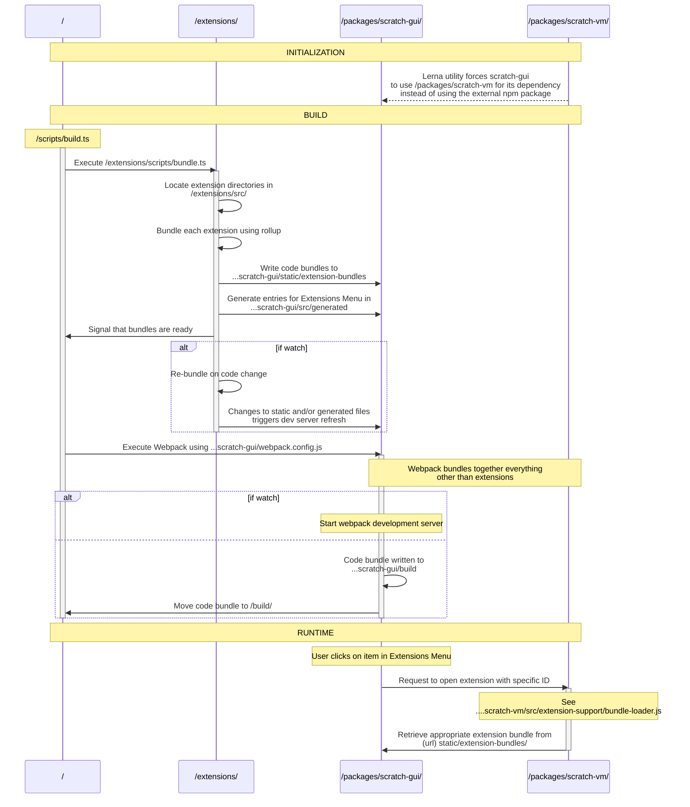

## Reference

### How Everything Fits Together

```mermaid
sequenceDiagram
    participant root as /
    participant A as /extensions/
    participant B as /packages/scratch-gui/
    participant C as /packages/scratch-vm/
    Note over root,C: INITIALIZATION
    C-->>B: Lerna utility forces scratch-gui <br>to use /packages/scratch-vm for its dependency <br>instead of using the external npm package
    Note over root,C: BUILD
    Note over root: /scripts/build.ts
    activate root
    root->>A: Execute /extensions/scripts/bundle.ts
    activate A
    A->>A: Locate extension directories in <br> /extensions/src/
    A->>A: Bundle each extension using rollup
    A->>B: Write code bundles to <br> ...scratch-gui/static/extension-bundles
    A->>B: Generate entries for Extensions Menu in <br>...scratch-gui/src/generated
    A->>root: Signal that bundles are ready
    alt if watch
        A->>A: Re-bundle on code change
        A->>B: Changes to static and/or generated files <br>triggers dev server refresh
    end
    deactivate A
    root->>B: Execute Webpack using ...scratch-gui/webpack.config.js
    activate B
    Note over B,C: Webpack bundles together everything <br>other than extensions
    alt if watch
        Note over B: Start webpack development server
    else 
        B->>B: Code bundle written to <br>...scratch-gui/build
        B->>root: Move code bundle to /build/
    end
    deactivate B
    deactivate root
    Note over root,C: RUNTIME
    Note over B: User clicks on item in Extensions Menu
    B->>C: Request to open extension with specific ID
    activate C
    Note over C: See <br>....scratch-vm/src/extension-support/bundle-loader.js
    C->>B: Retrieve appropriate extension bundle from <br> (url) static/extension-bundles/
    deactivate C
```